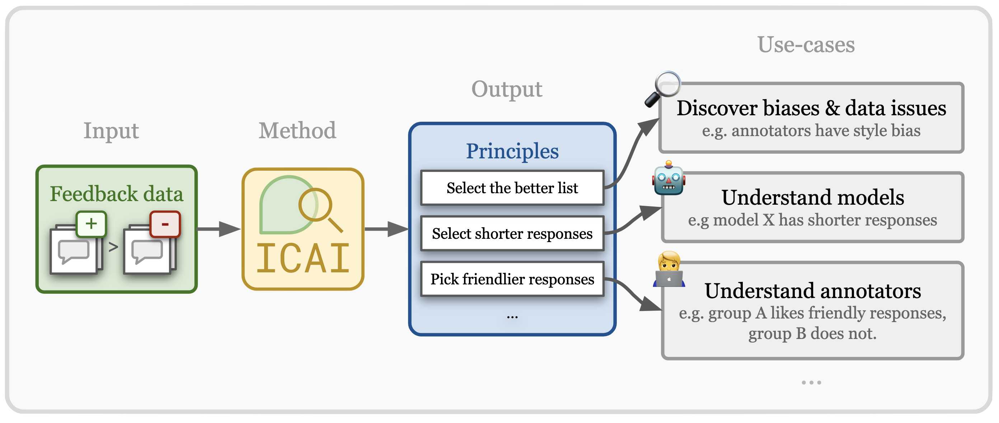
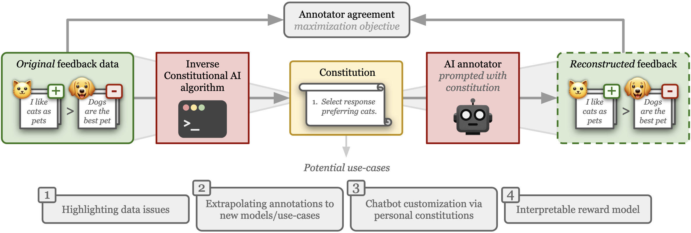
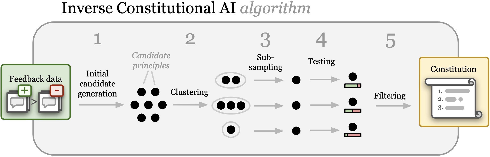

<p align="center">

</p>

# Inverse Constitutional AI

This repository contains the official implementation of the *Inverse Constitutional AI* (ICAI) algorithm [[paper]](https://arxiv.org/abs/2406.06560). ICAI compresses pairwise preference datasets into a readable list of principles (constitution) that the annotations appear to follow (e.g. "select the friendlier response"). ICAI principles provide an interpretable overview of a feedback dataset, enabling users to discover *problematic annotation biases*  or *better understand differences between datasets, user groups or models*.

> [!WARNING]
> Recent improvements to the quality of principle annotations in [v0.4.2](https://github.com/rdnfn/icai/releases/tag/v0.4.2) (and higher) require more API calls. This change **increases the default number of API calls by ~3x** over previous package versions for most experiments. Set `s3_num_seeds_to_reannotate_with=1` to retain the old behaviour and cost. Note that the new higher-quality (but more expensive) annotations are recommended if possible.

<p align="center">

</p>


## Installation

1. Pip install the package (for development installation see [here](#dev-installation))
    ```
    pip install inverse-cai
    ```
2. Set up API secrets: inside the main directory of the cloned repo (or wherever you like really) set up a `secrets.toml` file like below. You only need to include keys for APIs you want to use.
    ```toml
    OPENAI_API_KEY="<YOURKEY>"
    ANTHROPIC_API_KEY="<YOURKEY>"
    ```

## Quickstart

You can run your first Inverse Constitutional AI (ICAI) experiment using the `icai-exp` command:

```
icai-exp data_path="data/processed/example/example.csv"
```

This will run the ICAI algorithm on the toy `example.csv` pairwise feedback dataset and generate a constitution for this dataset.

To get the available experiment parameters and instructions on how to adjust them, run

```
icai-exp --help
```
>[!NOTE]
> **If you want more control**:
> the `icai-exp` command executes the `run` function inside [`./src/inverse_cai/experiment/core.py`](https://github.com/rdnfn/icai/blob/main/src/inverse_cai/experiment/core.py#L111). Edit that file, and the other parts of the `inverse_cai` Python package it uses, to fully adapt this code to your needs.

### Inspecting results

By default all experiment results are saved in the `./outputs/<DATE>_<TIME>` directory. The exact result file location is also printed to the console at the end of any (completed) `icai-exp` call. These outputs contain a full record of API calls, as well as intermediate states of the algorithm (proposed principles, clusters, distilled principles, etc.). Each result output follows the structure below:

```text
./outputs
└── 2045-03-07
    └── 12-09-43
        ├── api_calls.jsonl
        ├── core.log
        ├── main.log
        └── results
            ├── 010_principles_per_comparison.csv
            ├── 011_principles_list.json
            ├── 020_principle_clusters.json
            ├── 030_distilled_principles_per_cluster.json
            ├── 040_votes_per_comparison.csv
            ├── 041_votes_per_cluster.json
            ├── 050_filtered_principles.json
            ├── 060_constitution.json
            ├── 070_annotated_pairs_dataset.json
            ├── 092_results_training.csv
            └── 093_results_testset.json
```

#### Using results for further analysis: the *annotated-pairs* json format (v2.0)

When using ICAI for downstream use-cases or further analysis, we recommend using our `annotated-pairs` json format (saved as `070_annotated_pairs_dataset.json`). This format combines the input data alongside the annotations by ICAI's principle-following annotators. An example is shown below:


```json
{
  "metadata": {
    "version": "2.0",
    "description": "Annotated pairs dataset with annotations from ICAI",
    "created_at": "2025-04-02T16:02:37Z",
    "dataset_name": "ICAI Dataset - 2025-04-02_16-02-05",
    "default_annotator": "d36860d4"
  },
  "annotators": {
    "d36860d4": {
      "name": "Human",
      "description": "Human annotator from original dataset",
      "type": "human"
    },
    "2f45a6d0": {
      "description": "Select the response that evokes a sense of mystery.",
      "type": "principle"
    },
    "435cef52": {
      "description": "Select the response that features a more adventurous setting.",
      "type": "principle"
    }
  },
  "comparisons": [
    {
      "id": "4b49a6e7",
      "prompt": "Write a short story about a pet.",
      "response_a": {
        "text": "In the heart of a bustling city, a sleek black cat named Shadow prowled the moonlit rooftops, her eyes gleaming with curiosity and mischief. She discovered a hidden garden atop an old apartment building, where she danced under the stars, chasing fireflies that glowed like tiny lanterns. As dawn painted the sky in hues of orange and pink, Shadow found her way back home, carrying the secret of the garden in her heart.",
        "model": "Model X"
      },
      "response_b": {
        "text": "Across the town, in a cozy neighborhood, a golden retriever named Buddy embarked on his daily adventure, tail wagging with uncontainable excitement. He found a lost toy under the bushes in the park, its colors faded and fabric worn, but to Buddy, it was a treasure untold. Returning home with his newfound prize, Buddy's joyful barks filled the air, reminding everyone in the house that happiness can be found in the simplest of things.",
        "model": "Model Y"
      },
      "annotations": {
        "d36860d4": {
          "pref": "a"
        },
        "2f45a6d0": {
          "pref": "a"
        },
        "435cef52": {
          "pref": "a"
        }
      },
      "metadata": {
        "index": "0"
      }
    }
  ]
}
```

## Run experiment with your own data

To run ICAI on your dataset, you first need to convert it to a `csv` file with the following required columns:
- `text_a`, `text_b`: The text responses to compare
- `preferred_text`: The preferred response, must be one of `"text_a"` or `"text_b"`

Optional columns that will be included in the annotated pairs output:
- `input`: The prompt or question that elicited the responses
- `model_a`, `model_b`: The model names that generated each response

The text columns should be strings. If your dataset has a separate "prompt" or "input" column, you can include it as an `input` column in your CSV, and it will be properly included in the annotated pairs output. Entries in the column `preferred_text` should take one of two values: `"text_a"` or `"text_b"`. Ties or other annotation values are currently not used by the algorithm.

To run ICAI on your prepared dataset, simply use:

```
icai-exp data_path="<path/to/your-data.csv>"
```

## Run experiment from config file

In the `exp/configs` folder there is a number of configs to recreate experiments. You can run these experiments using the command:

```
icai-exp -cd ./exp/configs/<EXPERIMENT-DIR>
```

For example:

```
icai-exp -cd ./exp/configs/001_synthetic_orthogonal
```

>[!NOTE]
> **To re-run paper experiments**:
> Look at the README file inside the `exp/configs`. This file gives detailed instructions on which configurations to run, and how to generate the corresponding plots.

### Adding your own annotator functions

This implementation supports adding your own annotator functions. The functions should have the following kwargs and outputs:

```python
def some_annotator(data: pd.DataFrame, icai_results_dict: dict) -> pd.DataFrame:
    """Annotate the data using some method.

    Args:
        data (pd.DataFrame): The data to annotate. At least has columns "text_a", "text_b", "preferred_text"
        icai_results_dict (dict): The results of the ICAI algorithm. Dictionary with the following keys:
            - "feedback": pd.DataFrame, original data
            - "clusters": dict, the clusters
            - "summaries": dict, the cluster names (summaries)
            - "combined_votes": pd.DataFrame, the combined votes from the annotator
            - "filtered_principles": list, the filtered principles from the ICAI algorithm
            - "final_principles": list, the final principles from the ICAI algorithm
            - "constitution": str, the constitution
            - "results_path": pathlib.Path, path where ICAI results are stored.
    Returns:
        pd.DataFrame: The annotated data with column "annotation" added, column with values "text_a", "text_b", "tie", "irrelevant", or "invalid".
    """
```


### Using cache to continue aborted experiment

**[Experimental feature]** Sometimes long-running (expensive) ICAI experiments get interrupted. Instead of requiring a full re-run, the ICAI package supports continuing certain experiments after they were interupted. This feature is only available for the voting stage of experiments: only for experiments that do not generate principles but use a pre-existing principle list to test.

To re-start an experiment with log dir `exp/outputs/prior-experiment` and config dir `exp/configs/exp-config`, use the following command:
```
icai-exp -cd exp/configs/prior-experiment prior_cache_path='exp/outputs/prior-experiment'
```
>[!WARNING]
> Note that there is no strict config consistency check between cache and new experiment - thus use with caution, only using caches from prior experiments with identical configs.

### Running the PairRM baseline

The PairRM baseline experiment can be reproduced using the following command (assuming the processed data is in the standard location):

```
bash tools/baselines/pairrm/run.sh data/processed
```

## Development

### Dev installation

clone repo locally, e.g.
```
git clone git@github.com:rdnfn/icai.git
```
Then (inside repo folder) install package in editable mode:
```
pip install -e .
```

### Running test cases

Tests are included as part of the package. Run them using:

```bash
pytest ./src
```

### Simplest way to run experiment script
This doesn't do any meaningful experimental work but allows running the experiment script for testing purposes.

```
icai-exp generate_constitution=false annotator.alpaca_eval.constitution=null annotator.alpaca_eval.other_annotator_configs="[]"
```

### Creating a new release

Ensure that the current branch is up-to-date with main, and then bump the version (using `patch`, `minor`, or `major`):
```
bump-my-version bump patch
```

Then on the GitHub website create a new release named after the new version (e.g. "v0.1.2"). As part of this release in the GitHub interface, create a new tag with the updated version. This release will trigger a GitHub action to build and upload the PyPI package.

# Background

## Motivation

Feedback data plays an important role in fine-tuning and evaluating state-of-the-art AI models. Often pairwise text preferences are used: given two texts, human (or AI) annotators select the “better” one. Such feedback data is widely used to align models to human preferences (e.g., reinforcement learning from human feedback), or to rank models according to human preferences (e.g., Chatbot Arena). Despite its wide-spread use, prior work has demonstrated that human-annotated pairwise text preference data often exhibits unintended biases. For example, human annotators have been shown to prefer assertive over truthful texts in certain contexts. Models trained or evaluated on this data may implicitly encode these biases in a manner hard to identify. To be able to better understand existing pairwise text preference data, we formulate its interpretation as a compression task: the *Inverse Constitutional AI* problem. Read the [full paper](https://arxiv.org/abs/2406.06560) for more background.

## Method overview

The figure below provides an overview of the *Inverse Constitutional AI* (ICAI) problem we introduce: starting from a set of pairwise preference feedback, we derive a set of natural language principles (a *constitution*) that explain the preference data.
For validation, we re-construct the original preferences with an LLM judging according to the generated constitution. The constitution represents a (highly compact) compression of the preferences.

<p align="center">

</p>

## Algorithm

We introduce a first *Inverse Constitutional AI* (ICAI) algorithm that generates a set of principles based on a feedback dataset. See the figure below for an overview of the algorithm. Given a dataset of pairwise rankings, in Step 1 candidate principles are generated using an LLM. In Step 2, these principles are clustered using an embedding model. In Step 3, similar principles are “de-duplicated” by sampling one principle per cluster. In Step 4, each principle is tested to evaluate its ability to help an LLM reconstruct the original annotations. Finally in Step 5, the principles are filtered according to the testing results and a set of filtered principles are returned as the final constitution. Optionally, this last step is augmented with additional clustering and subsampling steps to ensure diverse principles. The implementation is provided in this repository.

<p align="center">

</p>

# Citation

If you find this work useful in your research, please consider citing our [ICLR 2025 paper](https://iclr.cc/virtual/2025/poster/30711) (also [available on arxiv](https://arxiv.org/abs/2406.06560)):
```bib
@inproceedings{findeis2025InverseConstitutionalAI,
  title = {Inverse {{Constitutional AI}}: {{Compressing Preferences}} into {{Principles}}},
  shorttitle = {Inverse {{Constitutional AI}}},
  booktitle = {The {{Thirteenth International Conference}} on {{Learning Representations}}},
  author = {Findeis, Arduin and Kaufmann, Timo and H{\"u}llermeier, Eyke and Albanie, Samuel and Mullins, Robert D.},
  year = {2025},
  url = {https://iclr.cc/virtual/2025/poster/30711},
}

```


# License

All code in this repo is licensed under [Apache-2.0](./LICENSE).
